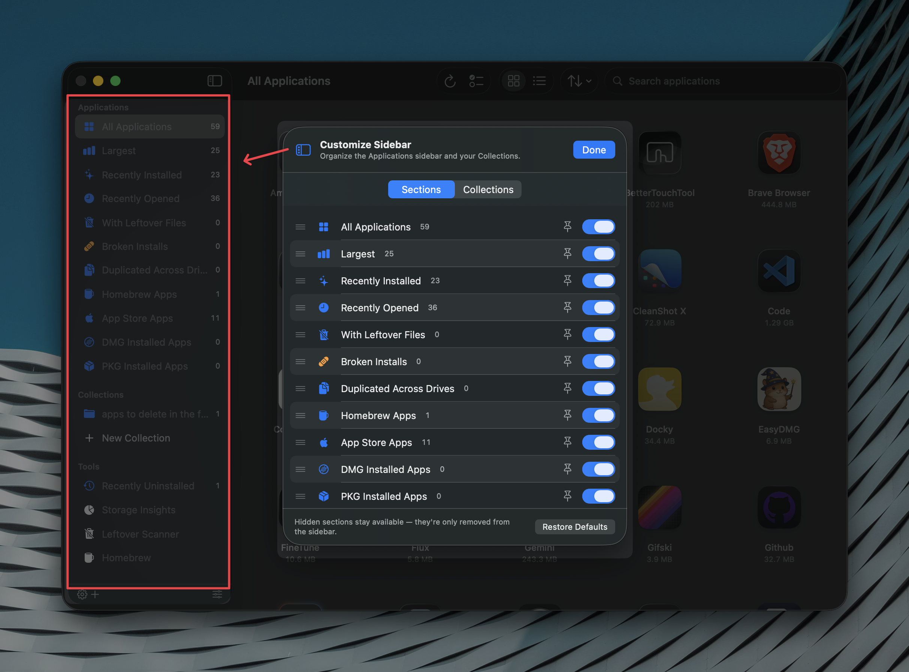
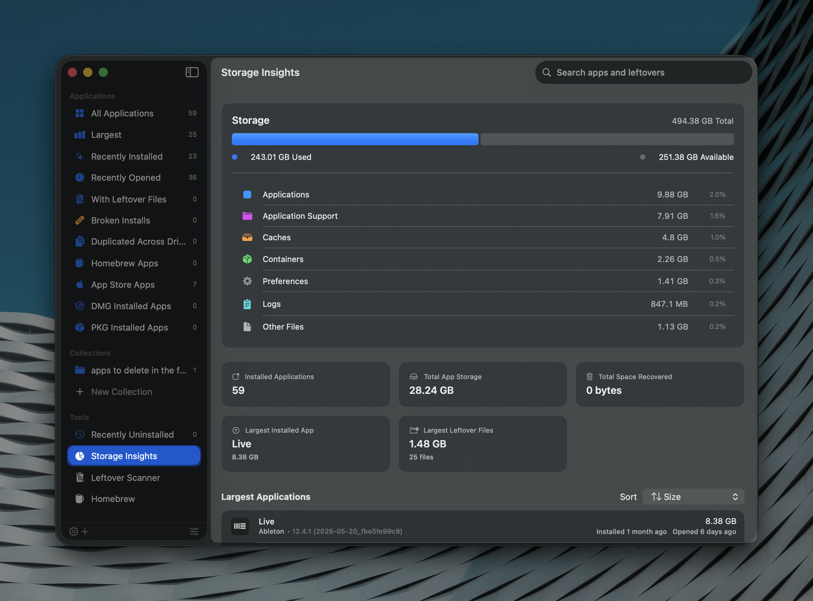
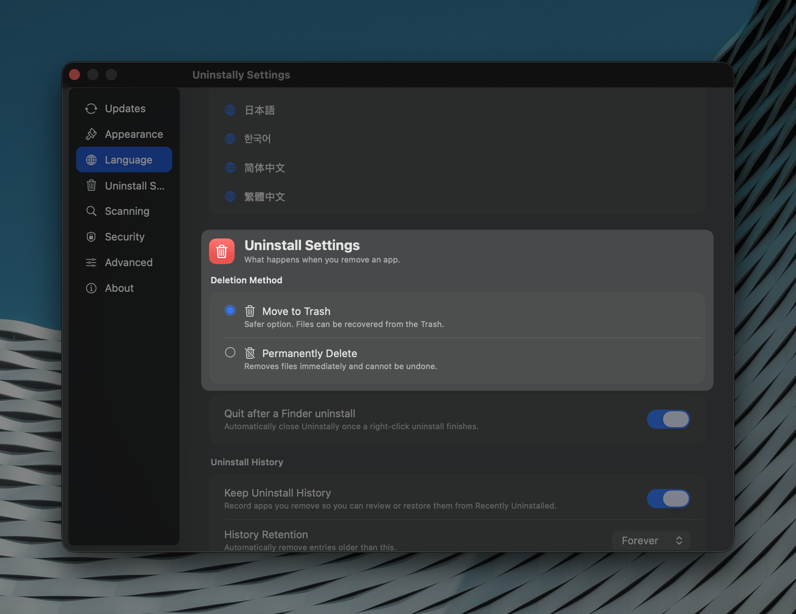

# Uninstally

[](https://github.com/gostonx/uninstally/releases/latest)
[](https://github.com/gostonx/uninstally/actions)
[](https://github.com/gostonx/uninstally/releases/latest)
[](LICENSE)

Uninstally is a native macOS uninstaller built with SwiftUI. Remove apps and their leftover files, manage Homebrew packages, and uninstall directly from Finder with a simple right click.

<p align="center">
  
</p>

## Install

### Homebrew (recommended)

```sh
brew tap gostonx/tap
brew install --cask uninstally
```

```sh
brew upgrade --cask uninstally
brew uninstall --cask uninstally
brew uninstall --cask --zap uninstally
```

## Features

- **Remove apps and their leftover files** — caches, preferences, containers, logs, and more
- **Finder right-click integration** — uninstall without opening the app
- **Homebrew support** — list and uninstall casks and formulae
- **Batch uninstall** — remove multiple apps at once
- **Collections** — group apps into custom tabs for organizing trials, projects, or categories
- **Recently Uninstalled** — review and restore previously removed apps
- **Leftover scanner** — find orphaned files from apps you deleted manually
- **Automatic updates** — built on Sparkle with stable, beta, and nightly channels
- **Native macOS design** — translucent materials, SF Symbols, VoiceOver support
- **Fast search and filtering** — sort by size, name, date, or developer
- **10 languages** — English, Italian, Spanish, French, German, Portuguese, Japanese, Korean, Simplified and Traditional Chinese
- **Privacy focused** — no analytics, no accounts, everything runs locally

## Screenshots

<p align="center">
  &nbsp;&nbsp;
  
  <br>
  
</p>

## Why Uninstally?

Dragging an app to the Trash leaves files behind — preferences in `~/Library/Preferences`, caches in `~/Library/Caches`, containers, logs, and saved state scattered across your drive. These files accumulate and waste storage over time.

Uninstally scans for every file linked to an application using its bundle identifier, then lets you review what was found before anything is removed. You stay in control.

### Direct download

Download the latest DMG from [Releases](https://github.com/gostonx/uninstally/releases/latest), open it, and drag **Uninstally** into **Applications**.

After installing, enable the Finder extension in **System Settings → General → Login Items & Extensions → Finder Extensions** to use the right-click integration.

## Privacy

Uninstally runs entirely on your Mac. No data is collected, no analytics are sent, and no account is required. Uninstall history is stored locally using SwiftData. Updates are downloaded directly from GitHub and verified with EdDSA signatures.

## Requirements

- macOS 14 or later
- Xcode 16 (for building from source)

## Troubleshooting

**Finder menu item not visible?**  
Enable the extension in System Settings → General → Login Items & Extensions → Finder Extensions. Restart Finder if needed (Option-right-click Finder icon → Relaunch).

**Gatekeeper blocks the app?**  
Right-click the app → Open → confirm. Or clear quarantine: `xattr -dr com.apple.quarantine /Applications/Uninstally.app`

**Homebrew packages not showing?**  
Make sure Homebrew is installed. Relaunch Uninstally after installing Homebrew so it can detect the binary.

**Leftover scan finds too many items?**  
Review each file and its match reason before proceeding. You can deselect anything you want to keep in the confirmation screen.

## Building from source

```bash
xcodebuild -project Uninstally.xcodeproj -scheme Uninstally \
  -configuration Debug -destination 'platform=macOS' build
```

For distribution builds, set `DEVELOPMENT_TEAM` in the project settings and enable automatic signing. Sparkle updates require a valid appcast and EdDSA key — see `docs/UPDATES.md`.

### Finder Extension

1. Run the app once so Launch Services registers it.
2. Go to **System Settings → General → Login Items & Extensions → Finder Extensions** and enable **Uninstally Finder**.
3. Right-click any `.app` bundle to see *Uninstall with Uninstally*.

### Full Disk Access

Grant Full Disk Access in System Settings → Privacy & Security to scan protected locations like `/Library`.

## Contributing

Contributions welcome. Fork → branch → PR. Keep changes focused and describe what changed and why. Run a local Xcode build before opening a PR.

## Security

Report vulnerabilities privately via the [security policy](https://github.com/gostonx/uninstally/security/policy) or contact the maintainers directly.

## License

See [LICENSE](LICENSE).

## Changelog

[CHANGELOG.md](CHANGELOG.md)
