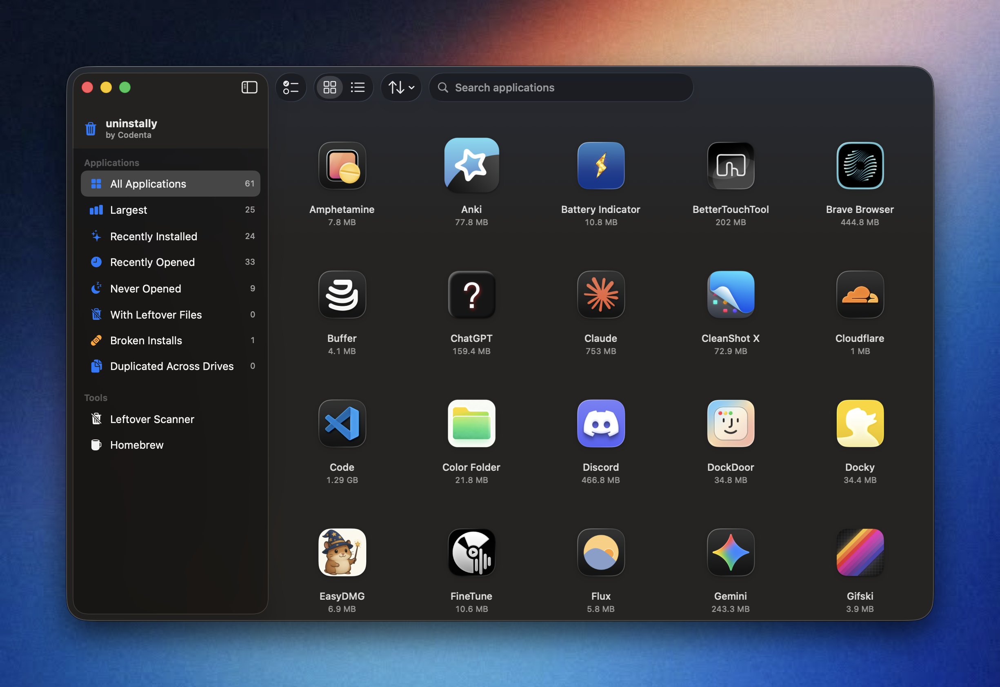
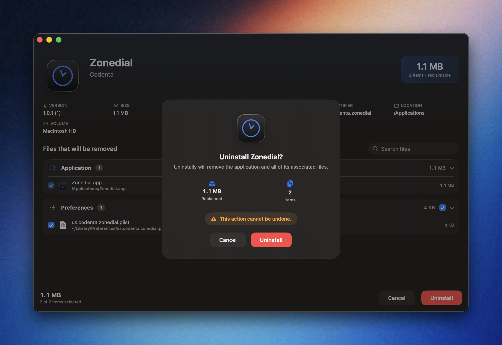

# Uninstally

<p align="center">
  
  
</p>

A native macOS uninstaller by **Codenta**: the simplest, cleanest way to
completely remove applications and every file they leave behind. Built entirely
with SwiftUI and Apple's native frameworks (no Electron, no web tech).

<p align="center">
  <a href="https://codenta.us/"><b>Website</b></a> ·
  <a href="https://github.com/gostonx/uninstally/releases/latest"><b>Download</b></a> ·
  <a href="https://codenta.us/">More from Codenta</a>
</p>

> Made by Codenta — explore all our macOS apps at **[codenta.us](https://codenta.us/)**.

---

## Highlights

- **Finder integration** — right-click any `.app` bundle → **"Uninstall with
  Uninstally"** launches straight into a confirmation window.
- **Smart, identifier-driven detection** — matches artefacts by *bundle
  identifier* (and helper namespaces harvested from the bundle), not just by
  folder name, across the entire Library hierarchy.
- **Standalone browser** — searchable grid/list of installed apps with sorting
  and smart filters (Largest, Recently Installed/Opened, Never Opened, With
  Leftovers, Broken Installs, Duplicated across drives).
- **Batch uninstall** — select several apps and remove them sequentially with an
  aggregate storage summary.
- **Leftover scanner** — finds orphaned support files, caches, containers,
  preferences, logs and old installers from apps you no longer have.
- **Homebrew support** — lists casks/formulae, shows dependency relationships and
  uninstalls (with optional `--zap` leftover removal).
- **Safe engine** — user-domain files go to the Trash (reversible); privileged
  items are removed behind a single administrator prompt. Live progress with the
  current file, percentage and ETA, then a completion summary.
- **Polished, HIG-native UI** — translucent materials, rounded corners, spring
  animations, SF Symbols, automatic light/dark, VoiceOver labels, drag-and-drop,
  keyboard shortcuts, native notifications and onboarding.
- **Accessory app** — no Dock icon, no menu-bar item. It appears only when opened
  directly or from Finder, and quits automatically after a Finder-initiated
  uninstall.

---

## Install

### Homebrew (recommended)

```sh
brew install --cask gostonx/tap/uninstally
```

Or tap first, then install:

```sh
brew tap gostonx/tap
brew install --cask uninstally
```

Update or remove later:

```sh
brew upgrade --cask uninstally     # update to the newest release
brew uninstall --cask uninstally   # remove the app
brew uninstall --cask --zap uninstally   # remove the app and its leftover files
```

### Direct download

Grab the latest **`Uninstally.dmg`** from the
[Releases page](https://github.com/gostonx/uninstally/releases/latest), open it,
and drag **Uninstally** into your **Applications** folder.

### First launch (unsigned build)

Uninstally is currently ad-hoc signed and not notarized, so macOS Gatekeeper may
block the first launch. Either **right-click the app → Open** and confirm, or
clear the quarantine flag:

```sh
xattr -dr com.apple.quarantine /Applications/Uninstally.app
```

(With Homebrew you can also install without quarantine:
`brew install --cask --no-quarantine gostonx/tap/uninstally`.)

Then enable the Finder menu item in **System Settings → General → Login Items &
Extensions → Finder Extensions**.

---

## Requirements

- macOS 14.0 or later (built and verified against the macOS 26 SDK / Xcode 26)
- Xcode 16 or later

## Build & Run

```bash
open Uninstally.xcodeproj
# Select the "Uninstally" scheme, then Run (⌘R)
```

Or from the command line:

```bash
xcodebuild -project Uninstally.xcodeproj -scheme Uninstally \
  -configuration Debug -destination 'platform=macOS' build
```

The project is configured for local **ad-hoc signing** (`CODE_SIGN_IDENTITY = "-"`)
so it builds with no team. For distribution, set your `DEVELOPMENT_TEAM`, switch
to automatic signing, and enable Hardened Runtime.

### Enabling the Finder extension

1. Run the app once so Launch Services registers it.
2. Open **System Settings → General → Login Items & Extensions → Finder
   Extensions** and enable **Uninstally Finder**.
3. Right-click any application bundle in Finder to see **"Uninstall with
   Uninstally"**.

### Full Disk Access

Because a complete uninstaller must reach protected locations, the app runs
outside the App Sandbox. Grant **Full Disk Access** (System Settings → Privacy &
Security) for the deepest scans.

---

## Architecture

MVVM with `@Observable` models and modern Swift concurrency (`async/await`,
`AsyncStream`, task groups). Clean separation of concerns:

```
Uninstally/
├── Uninstally/                  App target (file-system-synchronized group)
│   ├── UninstallyApp.swift      @main App + scene
│   ├── AppDelegate.swift        Accessory policy, file-open forwarding
│   ├── Models/                  AppInfo, RemovableItem, UninstallPlan, …
│   ├── Services/                Scanners, UninstallEngine, Homebrew, Icons, …
│   ├── ViewModels/              AppCoordinator + Observable screen models
│   ├── Views/                   Browser, Uninstall, Leftovers, Homebrew, …
│   ├── Utilities/               Formatting, FileSystem, LibraryPaths, matching
│   └── Assets.xcassets
├── UninstallyFinder/            Finder Sync extension target
│   └── FinderSync.swift
├── Config/                      Info.plists & entitlements (build-setting refs)
└── Uninstally.xcodeproj
```

### Key components

| Layer | Type | Responsibility |
|-------|------|----------------|
| Scanning | `ApplicationScanner` | Enumerates installed apps + metadata |
| Scanning | `AssociatedFileScanner` | Smart, identifier-driven artefact detection |
| Scanning | `LeftoverScanner` | Orphaned-file detection |
| Engine | `UninstallEngine` | Trash + elevated removal, streamed progress |
| Integration | `HomebrewService` | Package listing, dependencies, uninstall |
| Navigation | `AppCoordinator` | Routes standalone vs. Finder-initiated flows |

### Notes on the removal strategy

- User-domain artefacts are moved to the **Trash** (`FileManager.trashItem`),
  giving a native Undo affordance.
- System-domain artefacts (`/Library`, root-owned, privileged helpers) are
  removed in a single elevated `rm` batch via `NSAppleScript`'s
  `with administrator privileges`, so the user is prompted at most once.

---

## Safety

Nothing is removed without an explicit confirmation that shows the app icon,
name, reclaimable storage, item count and the warning **"This action cannot be
undone."** Every matched artefact records *why* it matched, and all items are
individually reviewable and de-selectable before you proceed.
